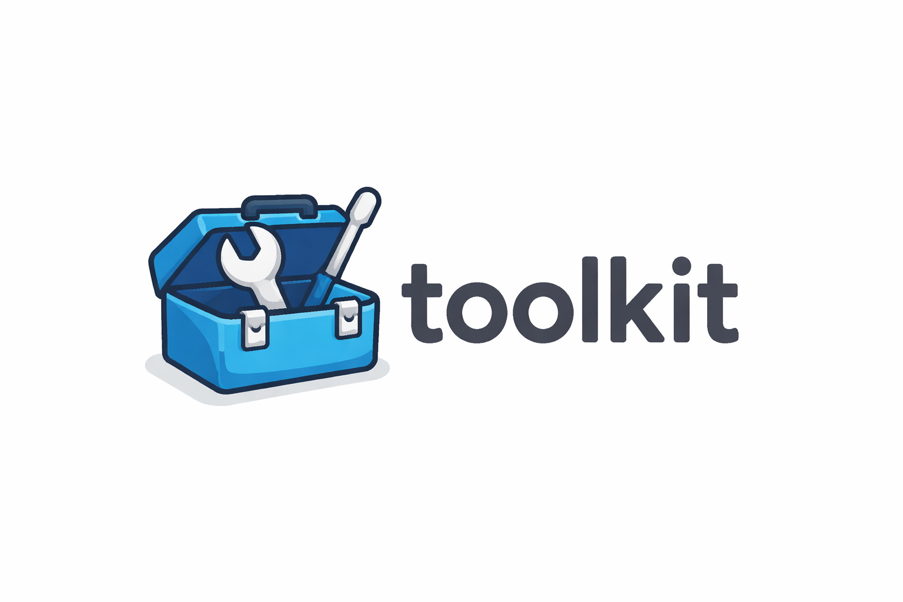

<div align="center">

<br />

# toolkit

toolkit is a developer-friendly TypeScript utility library with small, <br />
well-typed helpers for common tasks. It’s designed to reduce boilerplate, <br />
stay out of your way, and feel natural to use in everyday projects.

<hr />

</div>

## Getting Started

You can install this application from `npm` or `jsr`.

```sh
# recommended if using NodeJS
npx jsr add @bytebury/toolkit

# good, old-fashion npm
npm install @bytebury/toolkit --save

# or, if you're using Deno
deno add jsr:@bytebury/toolkit
```

## Sample Usage

```ts
function sayHelloTo(name: string): void {
  if (isWhitespace(name) {
    console.log("Hello, Guest!");
  } else {
    console.log(`Hello, ${title(name)}!`);
  }
}

function getAverageAge(): number {
  const people = [
    { name: "Tom", age: 2 },
    { name: "Carly", age: 8 },
    { name: "Jenny", age: 5 }
  ];
  return average(people.map(({ age }) => age)); // 5
}
```
